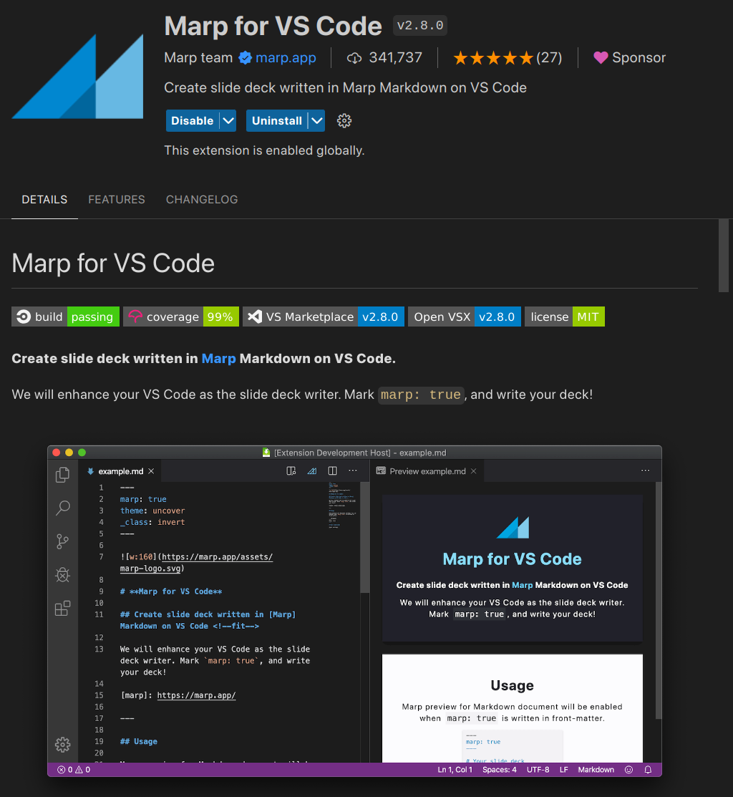

<!-- _class: titlepage -->
<!-- _backgroundImage: url("img/title-page-background.png") -->
<!-- _paginate: false -->
<!-- _footer: "" -->
##

##

##

##

##

# Jak szybko tworzyć prezentacje

# korzystając z VS Code i Marp

### Piotr Zawadzki

### 24.03.2024 

---

## Niezbędne oprogramowanie

###

<div class="columns">
<div>

- Visual Studio Code,
- rozszerzenie wspierające Marp,
- rozszerzenie LTeX może być użyteczne,
- i już.
- **nie musisz instalować VS Code. Skorzystaj z [vscode.dev](https://vscode.dev)!**

#### Poradniki

1. [https://www.youtube.com/watch?v=DG7FmbSojeY](https://www.youtube.com/watch?v=DG7FmbSojeY),
1. [Chris Ayers, Marp - Create Presentations with Markdown](https://dev.to/chris_ayers/marp-create-presentations-with-markdown-5e6k),
1. [Seven Tips For Getting The Most Out Of Marp](https://www.hashbangcode.com/article/seven-tips-getting-most-out-marp)
1. [Marpit Markdown](https://marpit.marp.app/markdown)

##### Kontent przygotowuje się w języku Markdown (plus małe wstawki HTML).

</div><div align="center" >



</div>
</div>

###

###


---

## Szablon

Przedstawiony szablon stara się być zgodny z zaleceniami ["Systemu Identyfikacji Wizualnej Politechniki Śląskiej"](https://www.polsl.pl/siwps/).

##### Najlepszym sposobem zapoznania się z procesm składu jest eksperyment z szablonem

#### Kroki niezbędne do instalacji

<div class="columns">
<div>

- Wykonaj fork tego repozytorium ([https://github.com/pzktit/marp-polsl-template](https://github.com/pzktit/marp-polsl-template)) na swoje konto GitHub. 
- Otwórz [https://vscode.dev](https://vscode.dev) lub ...
- Sklonuj repozytorium do lokalnego folderu i uruchom w nim VS Code. Jeżeli nie chcesz instalować zalecanego rozszerzenia otwórz DevContainer.

</div><div>

- Wyedytuj plik `slides/Slides.md`. **Nie zmieniaj jego nazwy**
- Rozszerzenie `Marp for VS Code` oferuje opcję podglądu wyników oraz eksportu do HTML i PDF.
-  Po wypchnięciu aktualnej treści prezentacji do GH, automatycznie uruchamia się budowanie `GitHub Pages` (budowanie musi być skonfigurowane na `GitHub Actions`). Jeżeli nie chcesz publikować wyników swojej pracy to zmień repo na prywatne albo usuń katalog `.git`.

</div>
</div>

###

###

<!--

Notatki prowadzącego

* wyjaśnić co to jest `vscode.dev`
* objaśnić GH pages i co to znaczy, że mają być ustawione GH Actions,
* wspomnieć o restrykcjach wprowadzynch przez GH na runnery, najlepiej wyświetlić działającą konfiguracje ze swojego konta 

-->

---

## Plik wejściowy

Plik wejściowy to niemal "zwykły" Markdown. Jedyna różnica polega na wprowadzeniu znaku podziału slajdów w postaci trzech znaków minus (dash): `---`. 

<div class="columns">
<div>

```
---
marp: true
theme: polsl
size: 16:9
---

## Slajd 1

blah blah blah

---

## Slajd 2

blah blah blah

```

</div><div>

- Pierwszy slajd jest specjalny i zawiera preambułę. Dostępne parametry preambuły można sprawdzić w VS Code skrótem `Ctrl+Spacja`.
- Wokół sekwencji `---` oddzielającej slajdy należy umieścić puste linie.
- W pliku konfiguracyjnym (`.vscode/settings.json`) VS Code należy poprawnie ustawić opcję umożliwiającą stosowanie wstawek HTML oraz ścieżkę do stylu (jeżeli klonowałeś repozytorium, to już to jest zrobione)
  
```json
"markdown.marp.enableHtml": true,
"markdown.marp.themes": [
    "./slides/themes/polsl.css"
    ],
"markdown.marp.exportType": "html",
```

</div>
</div>

---

## Struktura dokumentu

##### Sposób składu znaczników podziału na sekcje definiuje styl.

### Podział na sekcje

<div class="columns">
<div>

Strona tytułowa:

```
# Tytuł
## Podtytuł
### Autor
#### Data
##### Organizacja
```

</div><div>

Ciało dokumentu:

```
# Część
## Tytuł slajdu
### Nagłówek
#### Blok
##### Alert
```

</div>
</div>

### Szablon można łatwo dostosować

Skład prezentacji jest kontrolowany przez plik `slides/themes/polsl.css`.

###

###

---

## Zawartość slajdu

### Tekst

Skład slajdu może być jedno i dwukolumnowy. Więcej kolumn łatwo uzyskać, wprowadzając nowe klasy. Jednak celem tego szablonu jest zapewnienie maksymalnej prostoty edycji.

<div class="columns">
<div>

#### Wyliczanka 

To jest zwykły tekst po prostu wystarczy pisać $2\pi r = \sqrt{3 x^3}$ i pisać i pisać.
- jeden
- dwa
- trzy

</div>
<div>

#### Lista numerowana
To jest zwykły tekst po prostu wystarczy pisać.
1. jeden
2. dwa
3. **trzy**

</div>
</div>

---

## Zawartość slajdu

###

### Wyrażenia matematyczne

W tekście można umieszczać wyrażenia matematyczne zgodnie ze składnią _TeX_ (a dokładniej _MathJax_). Wrażenia mogą być wstawione $2\pi r = \sqrt{3 x^3}$ oraz wystawione 
$$  y=\int\limits_{0}^{\infty} e^{-x^2} dx $$

$$f(x) = \int_{-\infty}^\infty \hat f(\xi)\,e^{2 \pi i \xi x} \,d\xi\qquad\qquad I_{xx}=\int\int_Ry^2f(x,y)\cdot{}dydx $$

Jak widać efekt jest całkiem zadowalający. Pionowe wyrównanie tekstu najłatwiej osiągnąć wstawiając puste nagłówki w pożądanych miejscach.

###

###

###

---

## Zawartość slajdu

### Kod komputerowy

Obowiązują reguły dokładnie takie same jak dla języka Markdown. Dla większości języków programowania wspierane jest kolorowanie składni. Kolory przypisane do elementów logicznych są kontrolowane w pliku CSS stylu. Aby umieścić kod języka `Python`, należy zastosować następującą konstrukcję

<div class="columns">
<div>

Fragment pliku `Slides.md`

```
```py
# This is a Python script to calculate the factorial of a number

def factorial(n):
    """This function calculates the factorial of a number"""
    if n == 0:
        return 1
    else:
        return n * factorial(n-1)

num = 5
print("Factorial of", num, "is", factorial(num))
#``` znaku komentarza nie powinno tu być
```

</div>
<div>

Uzyskany wynik składu
```py
# This is a Python script to calculate the factorial of a number

def factorial(n):
    """This function calculates the factorial of a number"""
    if n == 0:
        return 1
    else:
        return n * factorial(n-1)

num = 5
print("Factorial of", num, "is", factorial(num))
```

</div>
</div>

###

###

---

## Zawartość slajdu

###

### Slajd może również zawierać grafikę

<div class="columns">
<div>

- Szczegółowy opis składni umożliwiającej włączenie grafiki opisano w dokumentacji [https://marpit.marp.app/image-syntax](https://marpit.marp.app/image-syntax).
- należy zwrócić uwagę, że proponowany styl zawiera już obraz tła, zatem korzystanie z opcji `bg` może prowadzić do niepożądanych skutków.
- Pliki zawierające grafikę nie muszą być zapisane na lokalnym dysku - można się do nich odwoływać poprzez `url`.

```md

```

</div>
<div style="justify-self: center; align-self: center">


</div>
</div>

---

## Zawartość slajdu


### Tabele

- Tabele są zawsze wycentrowane (względem slajdu lub kolumny) i mogą zawierać wyrażenia matematyczne
- Do umieszczania podpisów można wykorzystać makro `figcaption`

<div class="columns">
<div>

```md
| Column A | Column B | Column C | Column D |
| -------- | ------:  | :------- | :------: |
| A1       | B1       | C1       |    D1    |
| A2       | B2       | C2       |    D2    |
| A3       | B3       | C3       |    $y=\frac{2}{\pi}$    |
<figcaption style="font-size: 80%; text-align: center">
Tabela 1. Przykład podpisu pod rysunkiem lub tabelą.
</figcaption>
```

</div>
<div>

| Column A | Column B | Column C | Column D |
| -------- | ------:  | :------- | :------: |
| A1       | B1       | C1       |    D1    |
| A2       | B2       | C2       |    D2    |
| A3       | B3       | C3       |    D3    |
| A3       | B3       | C3       |    $y=\frac{2}{\pi}$    |
<figcaption style="font-size: 80%; text-align: center">
Tabela 1. Przykład podpisu pod rysunkiem lub tabelą.
</figcaption>

</div>
</div>


####

---

## Skład w wielu kolumnach

###
###
###

Możliwość podziału slajdu na dwie kolumny umożliwia kontener `columns`. Jego użycie zilustrowano we wzorcu, więc można go zacząć stosować "na wzór i podobieństwo". Kontener ten jest zrealizowany jako wstawka HTML elementu `grid`. Szczegółowy opis opcji jakie można stosować do wyrównania elementów w poziomie i pionie (przykłady użycia we wzorcu) przedstawiono w dokumencie [Chris House "A Complete Guide to CSS Grid"](https://css-tricks.com/snippets/css/complete-guide-grid/). Na podstawie zamieszczonego tam opisu bardzo łatwo stworzyć wzorce podziału obszaru slajdu na więcej logicznych elementów. Ale to już bardziej złożone zagadnienie.

###
###
###
###
---

##### Podczas eksportu do pliku HTML lokalne pliki graficzne nie są kopiowane. Należy je przenieść osobno i umieścić w odpowiednim podkatalogu względem pliku prezentacji. Podobny problem ma miejsce podczas prezentacji HTML na systemie bez dostępu do sieci! 

##### Format PDF jest samowystarczalny.

#

# Powodzenia!
